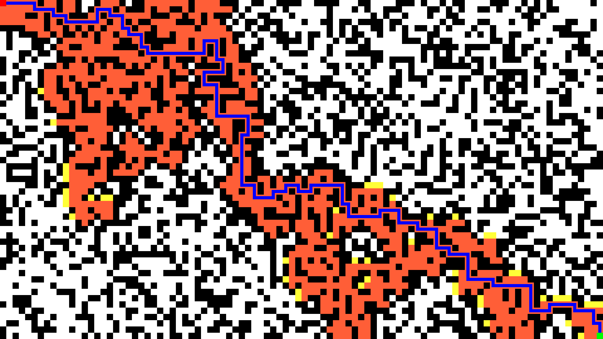
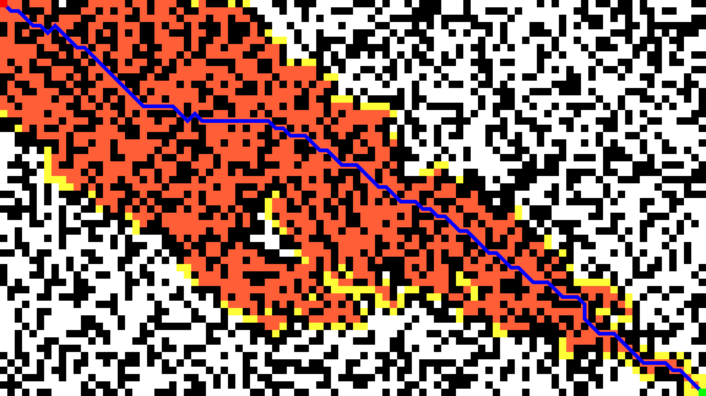
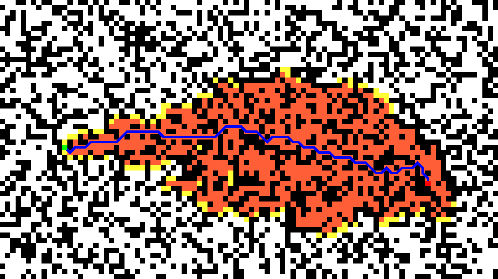

# A\* Pathfinding Algorithm

## Table of Contents

-   [Description](#description)
-   [Dependencies](#dependencies)
-   [Presentation](#presentation)

## Description

A\* pathfinding algorithm is a pathfinding algorithm that finds the shortest path between two points. It is a combination of Dijkstra's algorithm and a heuristic algorithm. The heuristic algorithm is used to estimate the distance between the current node and the end node. The heuristic algorithm used in this project is the Manhattan distance. The Manhattan distance is the distance between two points measured along axes at right angles. The Manhattan distance is calculated by adding the absolute difference between the x-coordinates and the y-coordinates of the two points. The Manhattan distance is used because it is faster to calculate than the Euclidean distance. 
[Wikipedia](https://en.wikipedia.org/wiki/A*_search_algorithm)

## Dependencies

-   [p5.js](https://p5js.org/)

## Presentation

<em>Without diagonal</em>

<em>With diagonal</em>

<em>With random start and end</em>
